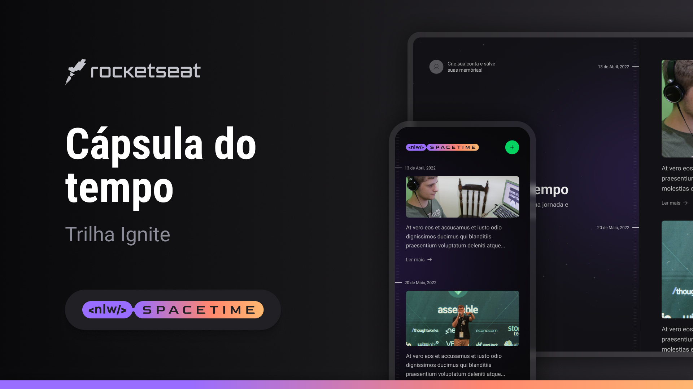

<h1 align="center">
    
NLW - Spacetime

</h1>

A NLW - Spacetime é um projeto desenvolido na Next evel Week, proposto pela @Rocketseat. O projeto é uma cápsula do tempo, com sistema de autenticação. Esta aplicação é fullstack, tendo desenvolvimento Front-End, tanto para Web quanto pra Mobile além do Back-end com APIs, rotas dinâmicas e muitas outras tecnologias! 

  <a href="#-tecnologias">Tecnologias</a>&nbsp;&nbsp;&nbsp;|&nbsp;&nbsp;&nbsp;
  <a href="#-projeto">Projeto</a>&nbsp;&nbsp;&nbsp;|&nbsp;&nbsp;&nbsp;
  <a href="#-layout">Layout</a>&nbsp;&nbsp;&nbsp;|&nbsp;&nbsp;&nbsp;
  <a href="#memo-licença">Licença</a>

  

 

  

## 🚀 Tecnologias

Esse projeto foi desenvolvido com as seguintes tecnologias:

- HTML, CSS e JavaScript
- Git e Github
- Figma
- Biblotecas:

   ### ***[PROJETO AINDA EM DESENVOLVIMENTO 🚧]***

## 💻 Projeto

A NLW - Spacetime é um projeto desenvolido na Next evel Week, proposto pela @Rocketseat. O projeto é uma cápsula do tempo, com sistema de autenticação. Esta aplicação é fullstack, tendo desenvolvimento Front-End, tanto para Web quanto pra Mobile além do Back-end com APIs, rotas dinâmicas e muitas outras tecnologias!.

- [Projeto ainda em desenvolvimento 🚧]()

## 🔖 Layout

Você pode visualizar o layout do projeto através [deste link 👋](https://www.figma.com/file/dmrt7Z7mKh5Hj3iMZkc7Ru/C%C3%A1psula-do-tempo-%E2%80%A2-Trilha-Ignite-(Community)?type=design&node-id=205-3&t=TimvEU3hY6J0FSjS-0). É necessário ter conta no [Figma](https://figma.com) para acessá-lo.

## :memo: Licença

Esse projeto está sob a licença MIT.

---

## ✍ Author
 

    Made with 💜 by Pedro Henrique Klein

    
    

