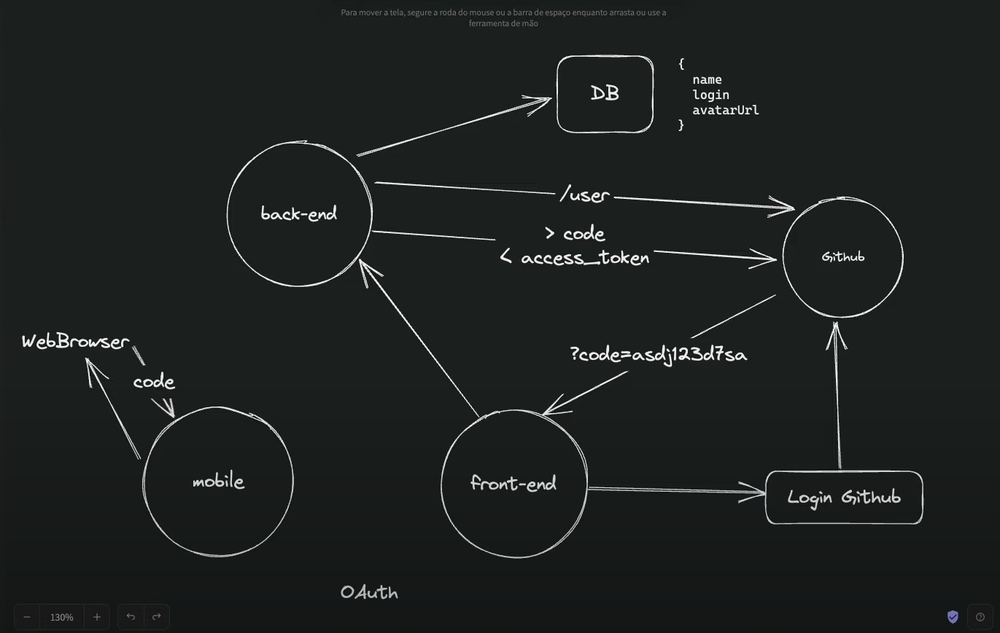

# Desenvolvimento da NLW - Spacetime
O aplicativo que será montado é uma capsula do tempo, utilizando React Next13 Tailwind, Prisma, Fastify, SQLite, Node.js,, Typescript, entre muitas outras techs! Abaixo vai ser um resumo do passo a passo do desenvolvimento da aplicação. Vamos desenvolver tanto uma versão para web quanto para mobile, ambos com bancos de dado e back ed

# Aula 1 - Iniciando o Projeto
Para criar um projeto usamos: 

```cmd
 mkdir server
 md server
 code .
```

Logo após:

```
npm init -y
```

Com isso, começamos a instalar as dependencias

```
npm i typescript -D
npm i @types/node -D
npm i fastify
```
Para configurar o typescript no nosso projeto, rodamos um:

```
npx tsc --init
```

e por fim, quando abrirmos o tsconfig, mudamos para o es2020 (EcmaScript).

## Criando a API
Dentro de src -> server.ts, iniciamos um servidor com

```js
const app = fastify()
```

Após isso, utilizamos um `listen`:

```js
app.listen({
  port: 3333,,
}).then(() => {
  console.log('HTTP server running on http://localhost:3333)
})
```

Para iniciarmos a criar as rotas usamos os HTTP methods como funções, então para criar uma rota `GET` utilizamos:

```js
app.get('/hello', () => {
  return 'Hello World'
})
``` 

## Implementação do ESLint
Para isso, instalamos o eslint como dependencia de desenvolvimento, além de baixar tembém a configuração padrão da Rocketseat:

```
npm install eslint -D
npm install @rocketseat/eslint-config -D
```

e por fim adicionamos ao `package.json` um script chamado "lint":

```json
  "lint": "eslint src --ext .ts --fix"
```

## Adicionando o Prisma
Para instalar o prisma, basta utilizarmos o:

```
npm install prisma -D
```

Após instalado, podemos ver seus comando com:

```
npx prisma -h
``` 

## Iniciando o Banco de Dados
Para criarmos o banco de dados utilizando o Prisma, usamos o seguinte comando:

```
npx prisma init --datasource-provider SQLite
```

Com isso feito, vamos a server/prisma/schema.prisma, lá vamos criar a nossa primeira tabela. As tabelas são chamadas de model no Prisma.

```prisma
model User {
  id   String @id @default(uuid())
  name String
}
```

Neste código, criamos a tabela Users, onde temos o `id` que é uma String, o @id identifica pro Prisma que aquele valor é de fato o Id da tabela, e o @default diz que é um valor padrão, que não somos nós quem preenchemos e por fim o `uuid()` gera um valor único e universal como `id`. <br>

Agora, vamos transformar nosso Schema escrito em Prisma para um arquivo escrito em SQL, para isso usamos o código:

```
npx prisma migrate dev
```

## Configurando o Front End
Para iniciarmos a configurar o Front End, vamos voltar a pasta inicial (sair da pasta server) e criar um projeto Next com o seguinte comando: 

```
  npx create-next-app@latest web --use-npm
```

Após rodar este comando, ele irá fazer uma série de perguntas, contudo vamos responder todas com `sim`. Afinal usaremos o Typescript, ESLint, Tailwind, 'src/' directory, App Router e o import alias e na útima opção apenas damos um enter.

<br><br>

### Configurações iniciais

Agora, vamos: 
- Deletar o README.md;
- remover os 2 arquivos da pasta public;
- na pasta app, removemos o favicon
- dentro de globals.css, removemos tudo menos os imports do `tailwind`
- dentro de page.tsx, apagamos tudo que for HTML

Após isso, vamos instalar novamente o `@rocketseat/eslint-config` e adicioná-lo ao projeto web. Para isso, depois de baixar, basta ir no arquivo `.eslintrc.json` e deixálo da seguint maneira: 

```json
{
  "extends": [
    "next/core-web-vitals", 
    "@rocketseat/eslint-config/react"
  ]
}
```

Agora vamos instalar a dependencia do Prettier para o Tailwind, com o seguinte comando: 

```
npm i prettier-plugin-tailwindcss -D
```

Depois de instalado, criamos um arquivo dentro da pasta `web` chamado `prettier.config.js`, onde vamos configurar da seguinte maneira: 

```js
module.exports = {
  plugins: [require('prettier-plugin-tailwindcss')],
}

```

## Preparando o Ambiente Mobile
Para podermos dar ínicio, volte a pasta raiz (saindo da pasta web) e rode o comando:

```
npx create-expo-app mobile
 ```

Logo então, trocamos a extensão `.js` do App para `.tsx` e então damos um 

 ```
 npm run start
 ``` 

 Vamos baixar no nosso telefone o App `Expo Go`, e vamo scanear o QR code que apareceu no terminal.
<br>
Por fim, vamos apenas instalar o eslint no nosso mobile também, pelo comando:

```
npm i eslint @rocketseat/eslint-config -D
```

E também vamos instalar novamente o plugin do prettier

```
npm i prettier-plugin-tailwindcss -D
```

Após instalar, criamos o arquivo `prettier.config.js` e configuramos da seuginte maneira: 

```js
module.exports = {
  plugins: [require('prettier-plugin-tailwindcss')],
}

```

<br><br>

# Aula 2 - Avançando o back-end e Front-end

## Front-end Web
Vamos começar abrindo nossa pasta Web

### **Configuração da Fonte**
Ao invés de importar do Google Fonts, o Next já tras uma integração com as fontes do Google. Vamos abrir dentro da pasta ***App*** o arquivo `layout.tsx`. Iremos alterar a importação da fonte *Inter* (que já vem) para Roboto_Flex e Bai_Jamjuree:

```js
import {
  Roboto_Flex as Roboto,
  Bai_Jamjuree as BaiJamjuree,
} from 'next/font/google'
```

Agora vamos alterar a `const inter` que já vem para duas novas variáveis: 

```js
const roboto = Roboto({ subsets: ['latin'], variable: '--font-roboto' })
const baiJamjuree = BaiJamjuree({
  subsets: ['latin'],
  weight: '700',
  variable: '--font-bai-jamjuree',
})
```

Como a fonte *BaiJamjuree* não é flex, precisamos definir os pesos da fonte que queremos. Com isso pronto, vamos apenas adicionar elas no *body* do nosso projeto, dentro da *className*, adicionamos o seguinte:

```tsx
<body className={`${roboto.variable} ${baiJamjuree.variable} font-sans bg-gray-900 text-gray-100`}>
    {children}
</body>
```

Podemos já alterar o título e a descrição da página, mudando e deixando da seguinte maneira: 

```js
export const metadata = {
  title: 'NLW Spacetime',
  description:
    'Uma cápsula do tempo construída com React, Next.js, Tailwind, TypeScript, Node, Prisma e muitas novas tecnologias!',
}
```

E para completar, vamos ao arquivo `tailwind.config.js`. Agora, iremos alterar o conteúdo de *extends* para o seguinte:

```js
extend: {
      fontFamily: {
        sans: 'var(--font-roboto)',
        alt: 'var(--font-bai-jamjuree)',
      },
    },
```

### **Estrutura visual da Home**
Antes de começarmos, precisamos importar algumas cores do Figma, então vamos copiar todos os hexadecimais e adicionálos ao `tailwind.config.js` na área de *extends*, dessa maneira substituindo as cores originais e além disso, vamos adicionar um ***blur***, para que possamos utilizar na home futuramente, vai ficar desse jeito:

*(aqui é o Pedro do futuro e resolvi já deixar aqui o arquivo completo, pra não ter que ficar alterando a todo momento)*

```js
extend: {
      fontFamily: {
        sans: 'var(--font-roboto)',
        alt: 'var(--font-bai-jamjuree)',
      },

      colors: {
        gray: {
          50: '#eaeaea',
          100: '#bebebf',
          200: '#9e9ea0',
          300: '#727275',
          400: '#56565a',
          500: '#2c2c31',
          600: '#28282d',
          700: '#1f1f23',
          800: '#18181b',
          900: '#121215',
        },
        purple: {
          50: '#f3eefc',
          100: '#d8cbf7',
          200: '#c6b2f3',
          300: '#ab8eee',
          400: '#9b79ea',
          500: '#8257e5',
          600: '#764fd0',
          700: '#5c3ea3',
          800: '#48307e',
          900: '#372560',
        },
        orange: {
          50: '#ffefeb',
          100: '#ffccc2',
          200: '#ffb4a4',
          300: '#ff927b',
          400: '#ff7d61',
          500: '#ff5c3a',
          600: '#e85435',
          700: '#b54129',
          800: '#8c3320',
          900: '#6b2718',
        },
        yellow: {
          50: '#fff9ec',
          100: '#ffebc4',
          200: '#ffe2a7',
          300: '#ffd47f',
          400: '#ffcc66',
          500: '#ffbf40',
          600: '#e8ae3a',
          700: '#b5882d',
          800: '#8c6923',
          900: '#6b501b',
        },
        green: {
          50: '#e6fbef',
          100: '#b1f1ce',
          200: '#8cebb6',
          300: '#57e295',
          400: '#36dc81',
          500: '#04d361',
          600: '#04c058',
          700: '#039645',
          800: '#027435',
          900: '#025929',
        },
      },

      fontSize: {
        '5xl': '2.5rem',
      },

      backgroundImage: {
        stripes:
          'linear-gradient(to bottom, rgba(255, 255, 255, 0.1), rgba(255, 255, 255, 0.1) 12.5%, transparent 12.5%, transparent)',
      },

      backgroundSize: {
        stripes: '100% 8px',
      },

      blur: {
        full: '194px',
      },
    },
```
E por fim vamos importar o favicon de dentro do Figma para dentro da pasta *App* com o nome `icon.png`, dessa maneira o Next já entende e coloca como favicon da nossa aplicação.

### **Atenção**
A parte de montagem e estrutura do HTML eu decidi por não anotar, por ser muito repetitiva e que seria muito código, então se quiser visualizar a estrutura dá página, de uma olhada nos arquivos do repositório acima


## Front-end Mobile
Agora entrando na pasta mobile, vamos trazer as cores e instalar as fontes. Começamos copiando o objeto `colors` que está acima e colando dentro do ***extends*** no `tailwind.config.js` da pasta mobile. Para instalar a fonte, vamos instalar um pacote:

```
npx expo install @expo-google-fonts/roboto @expo-google-fonts/bai-jamjuree expo-font
```

Após a instalação, vamos no `App.tsx` e vamos importar as fontes, além de importar o ***useFonts***, para podermos utilizá-las.

```tsx
import {
  useFonts,
  Roboto_400Regular,
  Roboto_700Bold,
} from '@expo-google-fonts/roboto'

import { BaiJamjuree_700Bold } from '@expo-google-fonts/bai-jamjuree'
```

E adicionamos o seguinte trecho de código no inicio do App: 

```tsx
const [hasLoadedFonts] = useFonts({
    Roboto_400Regular,
    Roboto_700Bold,
    BaiJamjuree_700Bold,
  })

  if (!hasLoadedFonts) {
    return null
  }
```

O ***if*** previne que a aplicação não seja carregada sem que a fonte já esteja pronta. Com isso feito, vamos apenas adicionar essas fontes ao Tailwind. Para isso, vamos em `tailwind.config.js` e adicionamos no ***extends***:

```js
fontFamily: {
  title: 'Roboto_700Bold',
  body: 'Roboto_400Regular',
  alt: 'BaiJamjuree_700Bold',
},
```

Agora vamos importar a imagem de blur roxa no fundo e colocar como ***ImageBackground*** da nossa aplicação, ficando dessa maneira: 

```tsx
import { StatusBar } from 'expo-status-bar'
import { ImageBackground } from 'react-native'

import blurBg from './src/assets/bg-blur.png'

export default function App() {
  return (
    <ImageBackground
      source={blurBg}
      className="flex-1 items-center bg-gray-900"
      imageStyle={{ position: 'absolute', left: '-100%' }}
    >
      <StatusBar style="light" translucent />
    </ImageBackground>
  )
}
```
Para podermos utilizar SVGs no ReactNative, precisaremos instalar algumas libs, vamos começar dessa maneira:

```
npx expo install react-native-svg

npm i -D react-native-svg-transformer
```

Agora criamos um documento chamado ``metro.config.js` na raiz da pasta mobile com o seguinte conteúdo:

```js
const { getDefaultConfig } = require("expo/metro-config");

module.exports = (() => {
  const config = getDefaultConfig(__dirname);

  const { transformer, resolver } = config;

  config.transformer = {
    ...transformer,
    babelTransformerPath: require.resolve("react-native-svg-transformer"),
  };
  config.resolver = {
    ...resolver,
    assetExts: resolver.assetExts.filter((ext) => ext !== "svg"),
    sourceExts: [...resolver.sourceExts, "svg"],
  };

  return config;
})();
```

E também criamos dentro de uma pasta a partir da raiz mobile > src > assets e criamos dentro o `assets.d.ts` com o seguinte: 

```ts
declare module '*.png'

declare module '*.svg' {
  import React from 'react'
  import { SvgProps } from 'react-native-svg'
  const content: React.FC<SvgProps>
  export default content
}
```

Com isso já podemos importar SVGs para o ReactNative, porém ele vem como um componente pra dentro da aplicação, então a gente pode fazer da seguinte maneira: 

```tsx
const StyledStripes = styled(Stripes)
```

Aqui, Stripes são as linhas na vertical, porém o Tailwind não reconhece componentes não nativos do React Native, então dessa maneira podemos customizar esse componente importado utilizando o ***syled***. Aqui abaixo tem um pequeno glossário em relação aos termos do ReactNative

| React       | ReactNative  |
|-------------|--------------|
|  div        |  View        |
|  p,h1,h2... |  Text        |
|  button     |  Touchable   |


## Back-end
Bom, para inicio, vamos mexer no nosso schema do prisma. Vamos criar uma nova tabela chamada Memory e atribuir ela a tabela User, dizendo que cada User tem um array de Memories e cada Memory está atribuida ao Id de algum User. 

```prisma
model User {
  id        String @id @default(uuid())
  githubId  Int    @unique
  name      String
  login     String
  avatarUrl String

  memories Memory[]
}

model Memory {
  id     String @id @default(uuid())
  userId String

  coverUrl  String
  content   String
  isPublic  Boolean  @default(false)
  createdAt DateTime @default(now())

  user User @relation(fields: [userId], references: [id])
}
```

### **Criando Rotas API**
Para iniciarmos, vamos criar uma pasta dentro de *src* chamada `routes`, e dentro dela um `memories.ts`, aqui vai ficar tudo ligado ao CRUD das memórias que serão cadastradas. 

<br>

Vamos criar também uma pasta detro de *src* chamada `lib` e dentro dela um arquivo `prisma.ts`. Lá vamos exportar a constante prisma que poderemos chamar em outros lugares da aplicação: 

```ts
import { PrismaClient } from "@prisma/client";

export const prisma = new PrismaClient({
  log: ['query']
})
```

Voltando ao `memories.ts`, vamos estar exportando uma função assíncrona (exigência do `fastfy`) com o nome que preferir, mas o parâmetro será o nosso ***app*** do `server.ts`. Como estamos utilizando o TypeScript, a tipagem do *app* é a **FastifyInstance**: 

```ts
import { FastifyInstance } from "fastify";
import { prisma } from "../lib/prisma";

export async function memoriesRoutes(app: FastifyInstance) {
  app.get('/users', async () => {
    const users = await prisma.user.findMany()
  
    return users
  }) 
```

e no `server.ts` podemos retirar a inicializção do Prisma. Também adicionamos o **.register()** para adicionar uma nova rota no `fastify`, passando como parâmetro a funcção asssíncrona criada antes

```ts
import fastify from 'fastify'
import { memoriesRoutes } from './routes/memories'

const app = fastify()

app.register(memoriesRoutes)

app
  .listen({
    port: 3333,
  })
  .then(() => {})
```

### ***CRUD***
No arquivo `memories.ts` vamos criar as rotas para o CRUD (**C**reate, **R**ead, **U**pdate, **D**elete), cada um com seu devido método HTTP:

```ts
import { FastifyInstance } from "fastify";
import { z } from 'zod'
import { prisma } from "../lib/prisma";

export async function memoriesRoutes(app: FastifyInstance) {

  // Rota para buscar as memórias - GET

  app.get('/memories', async () => {
    const memories = await prisma.memory.findMany({
      orderBy: {
        createdAt: 'asc'
      }
    })

    return memories.map(memory => {
      return {
        id: memory.id,
        coverUrl: memory.coverUrl,
        excerpt: memory.content.substring(0, 115).concat('...')
      }
    })
  })

  // Rota para buscar dados específicos de uma memória em específico - GET
  
  app.get('/memories/:id', async (request) => {
    const paramsSchema = z.object({
      id: z.string().uuid(),
    })

    const { id } = paramsSchema.parse(request.params)

    const memory = await prisma.memory.findUniqueOrThrow({
      where: {
        id,
      },
    })

    return memory
  })


  // Rota para criar uma memória - POST
  
  app.post('/memories', async (request) => {
    const bodySchema = z.object({
      content: z.string(),
      coverUrl: z.string(),
      isPublic: z.coerce.boolean().default(false)
    })

    const { content, coverUrl, isPublic } = bodySchema.parse(request.params)
    
    const memory = await prisma.memory.create({
      data: {
        content,
        coverUrl,
        isPublic,
        userId: ''
      }
    })

    return memory
  })
  

  // Rota para atualizar informações de uma memória - PUT

  app.put('/memories/:id', async (request) => {
    const paramsSchema = z.object({
      id: z.string().uuid(),
    })

    const { id } = paramsSchema.parse(request.params)

    const bodySchema = z.object({
      content: z.string(),
      coverUrl: z.string(),
      isPublic: z.coerce.boolean().default(false)
    })

    const { content, coverUrl, isPublic } = bodySchema.parse(request.params)

    const memory = await prisma.memory.update({
      where: {
        id,
      },
      data: {
        content,
        coverUrl,
        isPublic
      }
    })

   return memory
  })


  // Rota para deletar uma memória específica - DELETE
  
  app.delete('/memories/:id', async (request) => {
    const paramsSchema = z.object({
      id: z.string().uuid(),
    })

    const { id } = paramsSchema.parse(request.params)

    await prisma.memory.delete({
      where: {
        id,
      },
    })
  })
}
```
<br>

Por fim vamos instalar o CORS. O CORS é mais uma medida de segurança, ele irá determinar quais *URL*s vão pode acessar nossa API.

```
npm i @fastify/cors
```

e no arquivo `server.ts` a gente adiciona o seguinte: 

```ts
app.register(cors, {
  origin: true, // todas URLs de front-end poderão acessar nosso back-end
})
```

nesse caso, o ideal é que quando em produção, mude e `true` para um array de URLs, para podermos dizer qual front-end está permitido mandar requisições para o nosso back-end.  

<br><br>

# Aula 3 - Integrando UI com biblotecas

### **Fluxo de Autenticação**


<br><br>

### **Criando uma *OAuth Application* no Github** 
No Github, vamos em settings > developer settings > oauth applications. Vamos registrar uma aplicação com para desenvolvimento por hora. O caminho para callback pode ser `localhost:3000/api/auth/callback`

Vamos adicionar ao ``.env.local`` do front-end web (caso não enha, crie o arquivo no root web) e vamos adicionar o ``GITHUB_CLIENT_ID``, vamos fazer o mesmo na pasta server, porém além de adicionar o ``GITHUB_CLIENT_ID`` também vamos adicionar o ``GITHUB_CLIENT_SECRET``

Para disponibilizar essas variáveis com os arquivos no Next, precisamos adicionar um `NEXT_PUBLIC_` na frente delas, ficando `NEXT_PUBLIC_GITHUB_CLIENT_ID`

<br>

Nesse momento, componentizamos o código para melhor legibilidade.

<br>

### **Rota de autenticação e *access_token* no back-end**

Vamos criar a rota que irá receber o codigo do Github e converter em um access_token, para conseguirmos então autenticar ele.

Para que o back-end reconheça as variáveis de ambiente, precisamos instalar um dependencia:

```
npm i dotenv -D
```

<br>

Agora que já instalamos a lib, vamos criar um arquivo chamado `auth.ts` dentro da pasta ***routes***, esse arquivo será nossa rota de autenticação.

```ts
import { FastifyInstance } from "fastify";
import axios from 'axios'
import { z } from "zod";
import { prisma } from "../lib/prisma";

export async function authRoutes(app: FastifyInstance) {

  // Coleta do code da url 
  app.post('/register', async (request) => {
    const bodySchema = z.object({
      code: z.string(),
    })

    const { code } = bodySchema.parse(request.body)

    // Requisição do access_token em troca do code
    const accessTokenResponse = await axios.post(
      'https://github.com/login/oauth/access_token',
      null,
      {
        params: {
          client_id: process.env.GITHUB_CLIENT_ID,
          client_secret: process.env.GITHUB_CLIENT_SECRET,
          code,
        },
        headers: {
          Accept: 'application/json',
        },
      },
    )

    // Extraindo o access_token da response do Github
    const { access_token } = accessTokenResponse.data

    // Mandando uma requisição pro Github utilizando o access_token e pegando os dados do usuário
    const userResponse = await axios.get('https://api.github.com/user', {
      headers: {
        Authorization: `Bearer ${access_token}`
      }
    })

    // Schema padrão esperado de cada resposta do Github
    const userSchema = z.object({
      id: z.number(),
      login: z.string(),
      name: z.string(),
      avatar_url: z.string().url(),
    })

    const userInfo = userSchema.parse(userResponse.data)

    // Verificação se o usuário já existe
    let user = await prisma.user.findUnique({
      where: {
        githubId: userInfo.id,
      }
    })

    // Se não existe, aqui criamos o usuário no banco de dados
    if (!user) {
      user = await prisma.user.create({
        data: {
          githubId: userInfo.id,
          login: userInfo.login,
          name: userInfo.name,
          avatarUrl: userInfo.avatar_url,
        }
      })
    }
  })
}
```

Como o *access_token* expira muito rápido (menos de 1 dia), precisamos trabalhar com algo chamado JWT (JSON Web Token), que é basicamente um token, criado pelo nosso back-end, enviado para o front-end utilizar nas requisições que ele faz pro back-end pra gente identificar um usuário logado. Para fazermos isso, vamos instalar um pacote:

```
npm i @fastify/jwt
```

Agora vamos acrecentar ao arquivo `server.ts` o seguinte: 

```ts
app.register(jwt, {
  secret: 'qualquer-coisa-aqui-(de-preferencia-algo-bem-unico)', // o secret é o que diferencia o JWT gerado pelo nosso back-end dos outros JWT
})
```

<br>

Voltando ao `auth.ts`, vamos criar o token da seguinte maneira: 

```ts
// Criação do token JWT, passando 2 objetos, um com o data e o outro com a identificação com validade
const token = app.jwt.sign({
  name: user.name,
  avatarUrl: user.avatarUrl,
}, {
  sub: user.id, // Identificador que diferencia os users (algo único)
  expiresIn: '30 days',
})
```

***Atenção!*** Devo lembrar que esse *token* é **público**, então não guarde senhas ou algo do tipo, apenas dados essenciais para o funcionamento da aplicação, como o nome do usuário, sua foto de perfil e coisas do gênero. 

<br>

Agora com a bibloteca do JWT, temos acesso a algumas funções novas, então vamos no `memories.ts` e vamos adicionar algumas verificações de JWT nas funções do CRUD.

```ts

```

Como as informações passadas pelo ``.sign()`` do *fastify* são escolhidas por nós, o typescript não consegue reconhecer quais dados podem ser retirados na desestruturação do ``request.user``, por isso vamos criar um arquivo na pasta ***src*** chamado `auth.d.ts`. Dentro dele vamos configurar da seguinte maneira para que o typescript reconheça nossos campos:

```ts
import '@fastify/jwt'

declare module '@fastify/jwt' {
  export interface FastifyJWT {
    user: {
      sub: string
      name: string
      avatarUrl: string
    }
  }
}
```

Vamos por fim adicionar algumas verificações nas nossas rotas de CRUD, algo como: 

```ts
const memory = await prisma.memory.findUniqueOrThrow({
  where:{
    id
  }
})

if (memory.userId !== request.user.sub) {
  return reply.status(401).send()
}
```

Para mais detalhes da uma olhadinha nos arquivos, eles estão bem comentados.

### **Front-end**

Para dar início, vamos criar algumas rotas de api no nosso front-end. Vamos começar criando a seguinte sequência de pastas e arquivos `src > app > api > auth > callback > route.ts`. Com isso, vamos configurar essa rota da seguinte maneira:

```ts
import { api } from '@/lib/api'
import { NextRequest, NextResponse } from 'next/server'

export async function GET(request: NextRequest) {
  const { searchParams } = new URL(request.url)
  const code = searchParams.get('code')

  /* Acima pegamos o code da url e no código abaixo mandamos pro nosso back-end com o code como parâmetro */

  const registerResponse = await api.post('/register', {
    code,
  })

  const { token } = registerResponse.data

  const redirectUrl = new URL('/', request.url)

  const cookieExpiresInSeconds = 60 * 60 * 24 * 30 // 30 dias

  // Depois de recebermos o access_token, adicionamos ele nos cookies

  return NextResponse.redirect(redirectUrl, {
    headers: {
      'Set-Cookie': `tokens=${token}; Path=/; max-age=${cookieExpiresInSeconds}`,
    },
  })
}
```

Agora vamos instalar a seguinte bibloteca: 

```
npm i jwt-decode
```

Vamos então criar um componente igual ao `SignIn`(componente de login), porém chamado `Profile`. Também vamos criar um arquivo dentro de `lib` chamado `auth.ts` com o seguinte conteúdo:

```ts
import { cookies } from 'next/headers'
import decode from 'jwt-decode'

interface User {
  sub: string
  name: string
  avatarUrl: string
}

export function getUser(): User {
  // Pega o valor do cookie
  const token = cookies().get('token')?.value

  if (!token) {
    throw new Error('Unauthenticated')
  }

  // Traduz o conteúdo do cookie para um JSON
  const user: User = decode(token)

  return user
}
```

Dentro de `page.tsx`, vamos adicionar o seguinte:

```tsx
  import cookies from 'next/headers'

  const isAuthenticated = cookies().has('token')
```

E no lugar do `SignIn` vamos por: 

```tsx
  {isAuthenticated ? <Profile /> : <SignIn />}
```

<br>

Na hora de criar o `Profile`, quando importar o ***Image*** do Next, vai ser necessário configurar dentro do `next.config.js` com as seguintes configurações: 

```js
/** @type {import('next').NextConfig} */
const nextConfig = {
  images: {
    domains: ['avatars.githubusercontent.com'],
  },
}

module.exports = nextConfig
```

### **Front-end Mobile**

Para começar, vamos instalar alguns pacotes para conseguir fazer o fluxo de autenticação:

```
npx expo install expo-auth-session expo-crypto
```

Agora vamos no nosso `app.json` e vamos adicionar ao expo o seguinte:

```js
{
  "expo": {
    "scheme":"nlwspacetime", // o "nlwspacetime" é o nome do app
  }
}
```

E vamos ter que criar novamento um novo app dentro do OAuth application do Github. Na URL de callback usamos a url `exp://localhost:19000/--/*`

<br>

Agora vamos conseguir o code, assim como no web, porém no mobile. Vamos para o `App.tsx` e vamos adicionar logo abaixo do useFonts o seguinte: 

```tsx
const discovery = {
  authorizationEndpoint: 'https://github.com/login/oauth/authorize',
  tokenEndpoint: 'https://github.com/login/oauth/access_token',
  revocationEndpoint: 'https://github.com/settings/connections/applications/<CLIENT_ID>',
};

export default function App() {
  const [request, response, promptAsync] = useAuthRequest(
    {
      clientId: 'CLIENT_ID',
      scopes: ['identity'],
      redirectUri: makeRedirectUri({
        scheme: 'your.app'
      }),
    },
    discovery
  );

  useEffect(() => {
    if (response?.type === 'success') {
      const { code } = response.params

      api
        .post('/register', {
          code,
        })
        .then((response) => {
          const { token } = response.data

          console.log(token)
        })
    }
  }, [response])
```
Você apenas tem que substituir o 'your.app' pelo nome que você deu anterior mente e apagar os lugares CLIENT_ID e botar o código fornecido pelo Github (apagar o < e > também do < CLIENT_ID >).

<br><br>

Para guardar essas informações em memória, não podemos utilizar cookies, afinal não existem cookies no ambiente do ReactNative. Para isso vamos baixar um pacote: 

```
npx expo install expo-secure-store
```
e vamos substituir o `console.log()` do trecho acima por: `SecureStore.setItemAsync('token', token)`

<br>

Vamos agora baixar as dependencias para podermos fazer o sistema de rotas da nossa aplicação mobile.

```
npx expo install expo-router react-native-safe-area-context react-native-screens expo-linking expo-constants expo-status-bar
```

segue o link da documentação: https://expo.github.io/router/docs/

<br>

Dentro do `package.json` vamos adicionar embaixo das *devDependencies* o seguinte: 

```js
{
  "overrides": {
    "metro": "0.76.0",
    "metro-resolver": "0.76.0"
  }
}
```

e dentro do `babell.config.js` vamos adicionar a lista de plugins o seguinte plugin: 

```js
require.resolve("expo-router/babel")
```

Após isso, criamos uma pasta no root mobile chamada *app*, dentro dela criamos `index.tsx` e o `memories.tsx`. Copiamos todo o conteúdo de `App.tsx` e colamos dentro do nosso novo ***index.tsx***, depois disso já podemos deletar o ***App.tsx***. Vamos mexer no `useEffect` e deixá-lo mais clean code possíve e já redirecionar o usuário para a página ``memories.tsx`` após a autenticação:

```tsx
  async function handleGithubOAuthCode(code: string) {
    const response = await api.post('/register', {
      code,
    })

    const { token } = response.data

    await SecureStore.setItemAsync('token', token) // Guarda as informações de login (fake cookie)

    router.push('/memories') // Direciona o usuário pra uma nova rota
  }

  useEffect(() => {
    if (response?.type === 'success') {
      const { code } = response.params

      handleGithubOAuthCode(code)
    }
  }, [response])
```

# Aula 4 - Integrando web e mobile

### **Fron-end web**

Para começar, vamos adicionar novas páginas no web, para que quando o usuário queira cadastrar uma memória ele seja redirecionado para uma página de criação de memórias. Para isso vamos criar as seguintes pastas: `app > memories > new > page.tsx`. 

<br>

Podemos perceber que a parte da esquerda da aplicação, não sofre mudanças, independente da página. Isso é o layout dela, para configurarmos isso, vamos mover todo o lado esquerdo da nossa aplicação para o `layout.tsx`

Agora, nossa ``page.tsx`` está apenas com isso:

```tsx
import { EmptyMemories } from '@/components/EmptyMemories'

export default function Home() {
  return <EmptyMemories />
}
```

e o nosso `layout.tsx` está assim:

```tsx
export default function RootLayout({ children }: { children: ReactNode }) {
  const isAuthenticated = cookies().has('token')

  return (
    <html lang="pt-br">
      <body
        className={`${roboto.variable} ${baiJamjuree.variable} bg-gray-900 font-sans text-gray-100`}
      >
        <main className="grid min-h-screen grid-cols-2 ">
          {/* Left */}
          <div className=" relative flex flex-col items-start justify-between overflow-hidden border-r border-white/10 bg-[url(../assets/bg-stars.svg)] bg-cover px-28 py-16">
            {/* Blur */}
            <div className="absolute right-0 top-1/2 h-[288px] w-[526px] -translate-y-1/2 translate-x-1/2 rounded-full bg-purple-700 opacity-50 blur-full" />

            {/* Stripes */}
            <div className="absolute bottom-0 right-2 top-0 w-2 bg-stripes" />

            {isAuthenticated ? <Profile /> : <SignIn />}

            <Hero />

            <Copyright />
          </div>

          {/* Right */}
          <div className="flex flex-col bg-[url(../assets/bg-stars.svg)] bg-cover p-16">
            {children}
          </div>
        </main>
      </body>
    </html>
  )
}
```

Perceba que no lugar de `<EmptyMemories />` agora temos um *{children}*, isso quer dizer que tudo que retornar das outras páginas, será substituído naquele local deixando o resto da página igual. Massa né?

<br>

Vamos agora criar a funcionalidade de *logout* da nossa aplicação. Começamos criando a seguinte estrutura de pastas: `app > api > auth > logout > route.ts`. Dentro dele, configuramos da seguinte forma:

```ts
import { NextRequest, NextResponse } from 'next/server'

export async function GET(request: NextRequest) {
  const redirectUrl = new URL('/', request.url)

  // Basciamente colocamos cookies sem valor sobre o nosso anterior, apagando o anterior

  return NextResponse.redirect(redirectUrl, {
    headers: {
      'Set-Cookie': `token=; Path=/; max-age=0;`,
    },
  })
}
```

Agora vamos customizar a página ``page.tsx`` de dentro da pasta **new**, só antes vamos instalar um plugin: 

```
npm install -D @tailwindcss/forms
```

depois de intalar só temos que adicionar ele dento do arquivo `tailwind.config.js` na parte de *plugins*:

```js
  plugins: [require('@tailwindcss/forms')],
```

Agora com tudo pronto, a estilização já pode ser feita.

<br>

### **Middleware**

Precisamos agora nos preocupar com o seguinte problema: "E se o usuário não estiver logado mas conseguir entrar na página de registro de uma nova memória?". O middleware é como podemos restringir isso. Vamos começar criando um arquivo dentro de **src** chamado `middleware.ts` e vamos configurar da seguinte forma:

```ts
import { NextRequest, NextResponse } from 'next/server'

const signInURL = `https://github.com/login/oauth/authorize?client_id=${process.env.NEXT_PUBLIC_GITHUB_CLIENT_ID}`

export function middleware(request: NextRequest) {
  const token = request.cookies.get('token')?.value // Procura um token de login nos cookies

  if (!token) {
    // Não existe token? Logo não está logado, então vou te levar até o login
    return NextResponse.redirect(signInURL, {
      headers: {
        'Set-Cookie': `redirectTo=${request.url}; Path=/; HttpOnly; max-age=20;`,
      },
    })
  }

  // Se chegou aqui é porque ta logado, então pode seguir
  return NextResponse.next()
}

// Configurações com quais rotas ele deve ficar cuidando, no caso é qualquer uma depois de memories

export const config = {
  matcher: '/memories/:path*',
}
```

E dentro de `callback.ts` nós também adicionamos a funcionalidade para redirecionar para esse mesmo cookie que configuramos acima, caso ele exista, se não exister o fluxo da aplicação segue normalmente. O botão cadastrar memória do componente `Hero.tsx` também recebeu como link `<Link href="/memories/new>"`.

### **Front-end Mobile**

Vamos fazer várias coisas semelhantes à web, como setar o layout da aplicação. No ReactNative, criamos dentro da pasta ***app*** um arquivo ``_layout.tsx`` e fazemos o mesmo que fizemos na web

Desenvolvi **bastante** código nas rotas ``_layout.tsx`` e ``new.tsx`` então recomendo que passe e dê uma olhadinha nas estruturas das páginas.

### **Back-end**

Tudo que estávamos trabalhando até agora era JSON, a questão é, como vamos armazenar outros tipos de arquivos para imagens e vídeos? Para conseguirmos fazer isso, vamos baixar um pacote:

```
npm i @fastify/multipart
```

Depois de instalado, vamos importar ele no nosso `server.ts` e vamos adicionar um:

```ts
import multipart from '@fastify/multipart'

app.register(multipart)
```

Feito isso vamos criar uma nova rota em **routes** chamada `upload.ts`, para conseguirmos prosseguir nele, precisamos instalar um pacote:

```
npm i @fastify/static
```

O arquivo `upload.ts` então fica assim: 

```ts
import { FastifyInstance } from "fastify";
import { randomUUID } from "node:crypto";
import { createWriteStream } from "node:fs";
import { extname, resolve } from "node:path";
import { pipeline } from "node:stream";
import { promisify } from "node:util";

const pump = promisify(pipeline)

export async function uploadRoutes(app: FastifyInstance) {

  // Aqui estamos recebendo o arquivo na rota '/upload'
  app.post('/upload', async (request, reply) => {
    const upload = await request.file({
      limits: {
        fileSize: 5_42_880, // 5mb
      }
    })

    // Se entrou na rota e não teve upload
    if (!upload) {
      return reply.status(400).send()
    }

    // Verificação se é imagem ou vídeo apenas
    const mimeTypeRegex = /^(image|video)\/[a-zA-Z]+/
    const isValidFileFormat = mimeTypeRegex.test(upload.mimetype)
  
    // Se não for vídeo ou imagem recebe um bad request error
    if (!isValidFileFormat) {
      return reply.status(400).send()
    }
  
    // Criamos um ID random para servir de nome único concatenado com o nome original
    const fileId = randomUUID()
    const extension = extname(upload.filename)
    const fileName = fileId.concat(extension)

    // 
    const writeStream = createWriteStream(
      resolve(__dirname, '../../uploads/', fileName)
    )

    // É o que de fato faz acontecer
    await pump(upload.file, writeStream)


    // Gerar URL da imagem
    const fullUrl = request.protocol.concat('://').concat(request.hostname)
    const fileUrl = new URL(`/uploads/${fileName}`, fullUrl).toString()

    return { fileUrl }
  })
}
```

Precisamos também ir para o `server.ts` e adicionar a configuração:

```ts
app.register(require('@fastify/static'), {
  root: resolve(__dirname, '../uploads'),
  prefix: '/uploads',
})
```

# Aula 5 - O próximo nível

### **Front-end web**

Vamos começar, implementando o preview de quando você faz upload de uma imagem na nossa aplicação. Para isso vamos separar nosso input de imagens para um componente a parte. Criamos ele então chamado `MediaPicker.tsx` e o configuramos da seguinte maneira: 

```tsx
'use client'  // Diz para o React que esse componente deve carregar o JS para o clientside

import { ChangeEvent, useState } from 'react'

export function MediaPicker() {
  const [preview, setPreview] = useState<string | null>(null)

  // Pega o arquivo de foto, gera uma url e já exibe ela abaixo do campo
  function onFileSelected(event: ChangeEvent<HTMLInputElement>) { 
    const { files } = event.target

    if (!files) {
      return
    }

    const previewURL = URL.createObjectURL(files[0])

    setPreview(previewURL)
  }

  return (
    <>
      <input
        type="file"
        id="media"
        onChange={onFileSelected}
        className="invisible h-0 w-0"
        accept="image/*"
      />

      {/* Exibe a imagem selecionada */}
      {preview && (
        // eslint-disable-next-line
        
      )}
    </>
  )
}
```

Agora vamos para a criação da memória na prática. De maneira simples e resumida, o Next consegue fazer com que nossa aplicação não dependa do JS do ClientSide. Isso significa que até mesmo sem JS vai ser possível utilizar nosso app. Porém, para utilizar ações como `onSubmit` ou `onChange`, ele acabam precisando carregar o JS junto com eles, por isso colocamos acima de tudo um `'use client'`, porém como não é todo o app que precisa do JS, estamos componentizando e isolando aqueles que precisam do `'use client'` para funcionarem. Seguindo essa lógica, vamos repetir o processo pro **form** dentro de `page.tsx`, da pasta ***new***.

Vamos instalar também uma bibloteca `js-cookie`:

```
npm i js-cookie

npm i --save-dev @types/js-cookie
```

e vamos configurar o arquivo `NewMemoryForm.tsx` da seguinte maneira: 

```tsx
'use client'

import { Camera } from 'lucide-react'
import { MediaPicker } from './MediaPicker'
import { FormEvent } from 'react'
import { api } from '@/lib/api'
import Cookie from 'js-cookie'
import { useRouter } from 'next/navigation'

export function NewMemoryForm() {
  const router = useRouter() // Permit a navegação por rotas

  async function handleCreateMemory(event: FormEvent<HTMLFormElement>) {
    event.preventDefault() // Prevê o redirecionamento de página padrão do formulário

    const formData = new FormData(event.currentTarget)

    const fileToUpload = formData.get('coverUrl') // Pega o arquivo da imagem

    let coverUrl = ''

    // Se tiver uma imagem, ele vai mandar ela pra rota '/upload' do back-end
    if (fileToUpload) {
      const uploadFormData = new FormData()
      uploadFormData.set('file', fileToUpload)

      const uploadResponse = await api.post('/upload', uploadFormData)

      coverUrl = uploadResponse.data.fileUrl
    }

    const token = Cookie.get('token') // Buscamos o cookie de autorização (saber se está logado)

    // Criamos uma memória no banco de dados
    await api.post(
      '/memories',
      {
        coverUrl,
        content: formData.get('content'),
        isPublic: formData.get('isPublic'),
      },
      {
        headers: {
          Authorization: `Bearer ${token}`,
        },
      },
    )

    router.push('/') // Mandamos o usuário de volta pra home
  }

  return (
    <form onSubmit={handleCreateMemory} className="flex flex-1 flex-col gap-2">
      <div className="flex items-center gap-4">
        <label
          htmlFor="media"
          className="flex cursor-pointer items-center gap-1.5 text-sm text-gray-200 hover:text-gray-100"
        >
          <Camera className="h-4 w-4" />
          Anexar mídia
        </label>

        <label
          htmlFor="isPublic"
          className="flex items-center gap-1.5 text-sm text-gray-200 hover:text-gray-200"
        >
          <input
            type="checkbox"
            name="isPublic"
            id="isPublic"
            value="true"
            className="h-4 w-4 rounded border-gray-400 bg-gray-700 text-purple-500"
          />
          Tornar memória pública
        </label>
      </div>

      <MediaPicker />

      <textarea
        name="content"
        spellCheck={false}
        className="w-full flex-1 resize-none rounded border-0 bg-transparent p-0 text-lg leading-relaxed text-gray-100 placeholder:text-gray-400 focus:ring-0"
        placeholder="Fique livre para adicionar fotos, vídeos e relatos sobre essa experiência que você quer lembrar para sempre."
      />

      <button
        type="submit"
        className="inline-block self-end rounded-full bg-green-500 px-5 py-3 font-alt text-sm uppercase leading-none text-black hover:bg-green-600"
      >
        Salvar
      </button>
    </form>
  )
}
```


### **Front-end Mobile**

Para fazer a parte de seleção de imagens no mobile, vamos precisar de uma bilboteca:

```
npx expo install expo-image-picker
```

Sobre a estrutura e funcionalidade, ficou bem complexo então recomento que abra o arquivo `new.tsx` do ***mobile*** para entender melhor!

Vamos precisar instalar também a bibloteca `dayjs`:

```
npm i dayjs
```